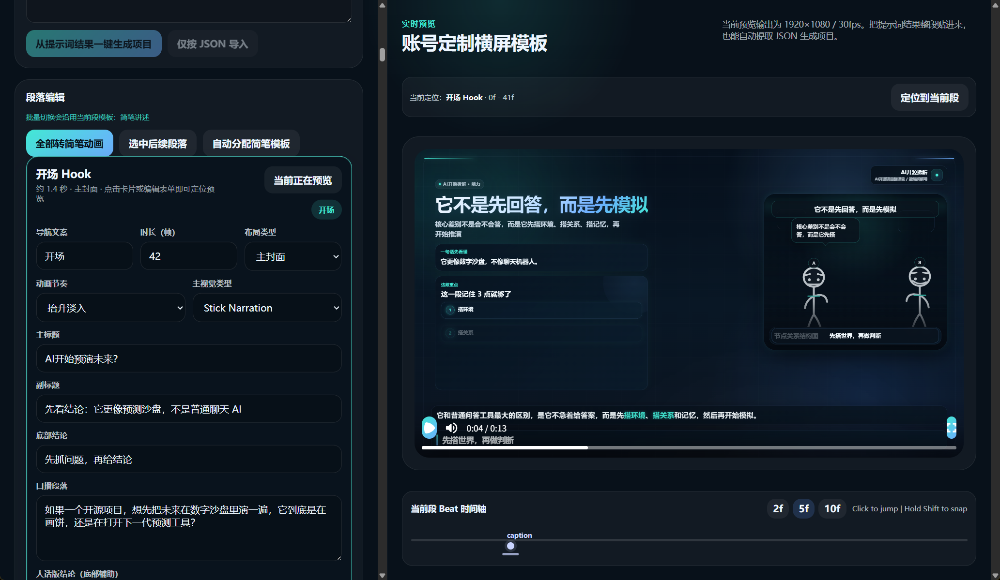
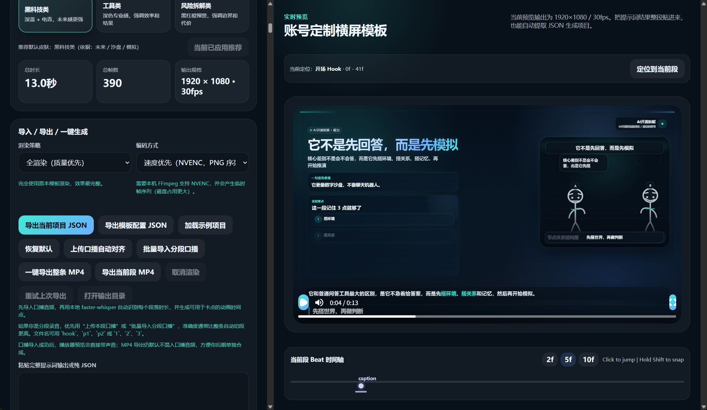

# Remotion Project Video Tool (English)

Project path: `PROJECT_ROOT`  
Chinese README: `README.md`

Quick links:
- Demo video: <paste your external link>
- Quick start: see “Simplest workflow”
- FAQ: see “FAQ (Short)”

Note: Any absolute paths shown in this document are examples. Replace them with your local project root.

This is an AI‑driven automated short‑video workflow demo. It turns “project link / project analysis” into `Remotion JSON` and renders `MP4`.

Features:

- Auto‑match templates and theme colors from LLM‑generated JSON
- Auto‑generate stick‑figure animation / images / video visualization areas
- Auto‑align voiceover audio with subtitles and animations
- Auto camera and animation choreography

This project is a prototype demo with known bugs. The author does not provide maintenance, updates, or support.
You are welcome to fork, modify, and improve it, and submit PRs.
Author: Oxecho
For learning and non‑commercial use only.

## Tech Stack

- Remotion
- React
- TypeScript
- Vite
- Node.js
- PowerShell (Windows scripts)
- Python (voiceover alignment)
- OpenAI API (optional)

## Demo Video

- <paste your external link>

## Screenshots




## 1. Who is this for

Good for:

- AI project breakdown videos
- Product demo videos
- Voiceover + text/visual animation videos
- People who want a fixed workflow from “link analysis -> structured script -> video”

## 2. Three common ways to open

### Option A: Recommended, open the panel after install

Double click:

- `PROJECT_ROOT\打开项目视频面板.cmd`

Or run:

```bash
npm run panel
```

Good for:

- No command line
- Paste links, run batch queue, view history, retry failures

### Option B: Open the editor

```bash
npm run editor
```

Good for:

- Manual edits to text, shots, timing, assets, voiceover
- Check render tasks
- Export full video or single segment

### Option C: Run one‑off tasks in CLI

```bash
npm run prompt:account
npm run json:account
npm run video:account
```

Good for:

- Batch processing
- Script debugging
- Advanced manual control

## 3. First‑time setup

### 3.1 Fast install

Double click:

- `PROJECT_ROOT\一键安装项目工具.cmd`

Or run:

```bash
npm install
```

Optional environment check:

- `PROJECT_ROOT\首启环境检查.cmd`

### 3.2 Configure OpenAI Key (optional)

Any of the following:

Option 1: One‑click setup

- `PROJECT_ROOT\一键配置OpenAI密钥.cmd`

Option 2: Configure inside the panel

In the panel top OpenAI section, set:

- `OPENAI_API_KEY`
- `OPENAI_MODEL` (default `gpt-5`)

It writes to:

- `PROJECT_ROOT\.env.local`

Option 3: Edit `.env.local` manually

```env
OPENAI_API_KEY=your_key
OPENAI_MODEL=gpt-5
```

Note: If you only want “generate prompt -> paste into chat -> get JSON -> come back to render/edit”, you do not need an OpenAI key.

## 4. Simplest workflow

### 4.1 Generate video from a link

1. Open panel
2. Paste project link
3. Choose target duration (60s / 300s)
4. Fill project name and extra requirements if needed
5. Click “Generate Video”
6. Wait for JSON + MP4
7. Output folder opens automatically

### 4.2 Generate prompt only

Double click:

- `PROJECT_ROOT\一键生成项目提示词.cmd`
- `PROJECT_ROOT\一键生成项目提示词-5分钟.cmd` (target ~5 min)

Or run:

```bash
npm run prompt:account -- --link <project link> --name <project name>
```

Output folder:

- `PROJECT_ROOT\out\prompts`

### 4.2.1 No OpenAI key workflow

1. Copy GitHub link
2. Run `PROJECT_ROOT\一键生成项目提示词.cmd` (prompt copied to clipboard)
3. Paste prompt into ChatGPT or any model that can browse the link, ask it to output JSON only
4. Paste JSON into the editor right‑side input “Paste full prompt output or pure JSON”, click “Import JSON”
5. Export full MP4 or single segment

### 4.3 Generate JSON only

Double click:

- `PROJECT_ROOT\一键生成项目JSON.cmd`
- `PROJECT_ROOT\一键生成项目JSON-5分钟.cmd` (target ~5 min)

Or run:

```bash
npm run json:account -- --link <project link> --name <project name>
```

Note: If no OpenAI key is configured, these scripts fall back to “prompt only + copy to clipboard”.

Output folders:

- `PROJECT_ROOT\out\json`
- `PROJECT_ROOT\out\openai`

### 4.4 Render MP4 from JSON

```bash
node scripts/render-account-from-json.mjs out/json/your-project.json out/videos/your-project.mp4
```

### 4.4.1 Segment rendering (faster)

Render only changed segments, then merge:

```powershell
$env:RENDER_SEGMENTS=1
node scripts/render-account-segments.mjs out/json/your-project.json out/videos/your-project.mp4
```

You can also enable it in the one‑click script:

```powershell
$env:RENDER_SEGMENTS=1
powershell.exe -NoLogo -ExecutionPolicy Bypass -File scripts/build-project-video.ps1 -OpenFolder
```

### 4.5 Stick animation templates

Supported scenes:

- `stick-dialogue`
- `stick-conflict`
- `stick-compare`
- `stick-narration`

Sample JSON:

- `PROJECT_ROOT\examples\stick-animation-demo.json`

Test command:

```bash
npm run test:stick
```

## 5. Panel details

Main file:

- `PROJECT_ROOT\scripts\project-studio-panel.ps1`

### 5.1 Current project section

Fields:

- Project link
- Project name
- Extra requirements

Supports:

- Paste from clipboard
- Drag `.txt` / `.md` / `.url`
- Drag text that contains links

### 5.2 Actions

Common buttons:

- Generate final prompt
- Generate project JSON
- Generate video
- Add to batch queue
- Open prompts folder
- Open JSON folder
- Open videos folder
- Refresh status

### 5.3 Queue

Supports:

- Batch import links
- Run all
- Fill failed items
- Retry only failed items
- Failure strategies: ask / skip / stop

### 5.4 History

Supports:

- Search
- Sort by time
- Filter: all / with video / failed
- Load current
- Re‑render
- View error detail
- Open output video

## 6. Editor details

Start:

```bash
npm run editor
```

### 6.1 What the editor can do

- Import project JSON
- Parse full prompt output and auto extract JSON
- Edit base info
- Edit segments
- Import voiceover
- Batch match voiceover
- Align beats
- Export full video
- Export current segment
- Cancel render tasks
- Open output folder

### 6.2 Import methods

- Paste pure JSON and import
- Paste full prompt output and auto detect JSON code block

## 7. Directory map

### 7.1 Important scripts

- `PROJECT_ROOT\scripts\build-project-analysis-prompt.mjs`
- `PROJECT_ROOT\scripts\build-project-json.mjs`
- `PROJECT_ROOT\scripts\render-account-from-json.mjs`
- `PROJECT_ROOT\scripts\build-project-video.ps1`
- `PROJECT_ROOT\scripts\project-studio-panel.ps1`

### 7.2 Output folders

- `PROJECT_ROOT\out\prompts`
- `PROJECT_ROOT\out\json`
- `PROJECT_ROOT\out\openai`
- `PROJECT_ROOT\out\videos`
- `PROJECT_ROOT\out\panel-data`

## 8. FAQ (Short)

### 8.1 Missing `OPENAI_API_KEY`

It means no key configured or current process cannot read `.env.local`.

Fix:

- Save key again in the panel
- Check `.env.local` exists
- Check key validity

### 8.2 OpenAI 401

Key is invalid, expired, wrong permission, or wrong key type.

### 8.3 JSON generation failed

Common causes:

- Network issues
- OpenAI response error
- Invalid JSON output
- Prompt file missing

### 8.4 MP4 render failed

Common causes:

- `npm install` incomplete
- `@remotion/cli` missing
- Output folder not writable
- Asset URL invalid
- Missing local dependencies

### 8.5 Panel tasks failed

Suggested steps:

1. Check logs at the bottom
2. Filter “failed” in history
3. Click “error detail”
4. For queues: “fill failed” or “retry failed”

## 9. Recommended checks

```bash
npm run check
npm run editor:build
npm run test:config
npm run test:stick
npm run test:render
npm run test:render-diagnostics
```

## 10. Maintenance notes

- Do not manually delete `out/panel-data` unless you want to clear history and failures
- Do not change script stdout formats casually
- If you switch machines, check: Node.js, `npm install`, `.env.local`, prompt file paths
- If handing over to others, include: README, PROJECT_STATUS.md, and the panel launcher

## 11. Publish to GitHub (Beginner Steps)

1. Clean generated files (run in repo root):
```powershell
Remove-Item -Recurse -Force node_modules, out, output, .tmp, tmp, .playwright-cli, .factory, editor\dist, scripts\__pycache__ -ErrorAction SilentlyContinue
```
2. Initialize and check:
```powershell
git init
git add -A
git status
```
Make sure `.env.local`, `out/`, `node_modules/` are not staged.
3. Commit:
```powershell
git commit -m "Initial open-source release"
```
4. Create a new Public repo on GitHub (do not auto‑generate README/License).
5. Add remote and push:
```powershell
git branch -M main
git remote add origin https://github.com/<your-username>/<repo-name>.git
git push -u origin main
```
